<!--
═══════════════════════════════════════════════════════════════════════════════
  ABDUL GHAFOOR · GITHUB PROFILE
  Repo: Ags-Ghafoor601/Ags-Ghafoor601   (name must match the username exactly)

  Every visual on this page is generated from files in this repository.
  assets/header-*.svg     hand-written animated SVG · radar sweep
  assets/divider-*.svg    hand-written animated SVG · oscilloscope trace
  assets/timeline-*.svg   hand-written animated SVG · career rail
  assets/radar-*.svg        hand-written animated SVG · skill radar
  assets/architecture-*.svg hand-written animated SVG · retrieval pipeline
  assets/telemetry-*.svg      rendered daily by tools/telemetry.py from the GitHub API
  assets/contributions-*.svg  rendered daily from the contributions GraphQL API
═══════════════════════════════════════════════════════════════════════════════
-->

<div align="center">

<picture>
  <source media="(prefers-color-scheme: dark)" srcset="./assets/header-dark.svg">
  <source media="(prefers-color-scheme: light)" srcset="./assets/header-light.svg">
  
</picture>

<a href="https://abdul-portfolio-swart.vercel.app"><picture><source media="(prefers-color-scheme: dark)" srcset="https://img.shields.io/badge/PORTFOLIO-0D1117?style=for-the-badge&logo=vercel&logoColor=22D3EE&labelColor=0D1117"><source media="(prefers-color-scheme: light)" srcset="https://img.shields.io/badge/PORTFOLIO-F6F8FA?style=for-the-badge&logo=vercel&logoColor=0891B2&labelColor=F6F8FA"></picture></a>
<a href="https://www.linkedin.com/in/abdul-ghafoor-ags"><picture><source media="(prefers-color-scheme: dark)" srcset="https://img.shields.io/badge/LINKEDIN-0D1117?style=for-the-badge&logo=data%3Aimage%2Fsvg%2Bxml%3Bbase64%2CPHN2ZyB4bWxucz0iaHR0cDovL3d3dy53My5vcmcvMjAwMC9zdmciIHZpZXdCb3g9IjAgMCAyNCAyNCIgZmlsbD0iIzIyRDNFRSI%2BPGNpcmNsZSBjeD0iNSIgY3k9IjYiIHI9IjIuNiIvPjxjaXJjbGUgY3g9IjUiIGN5PSIxOCIgcj0iMi42Ii8%2BPGNpcmNsZSBjeD0iMTguNSIgY3k9IjEyIiByPSIzLjIiLz48cGF0aCBkPSJNNy4yIDcuMSAxNS43IDExIDE1IDEyLjcgNi41IDguOHpNNi41IDE1LjIgMTUgMTEuM2wuNyAxLjctOC41IDMuOXoiLz48L3N2Zz4%3D&labelColor=0D1117"><source media="(prefers-color-scheme: light)" srcset="https://img.shields.io/badge/LINKEDIN-F6F8FA?style=for-the-badge&logo=data%3Aimage%2Fsvg%2Bxml%3Bbase64%2CPHN2ZyB4bWxucz0iaHR0cDovL3d3dy53My5vcmcvMjAwMC9zdmciIHZpZXdCb3g9IjAgMCAyNCAyNCIgZmlsbD0iIzA4OTFCMiI%2BPGNpcmNsZSBjeD0iNSIgY3k9IjYiIHI9IjIuNiIvPjxjaXJjbGUgY3g9IjUiIGN5PSIxOCIgcj0iMi42Ii8%2BPGNpcmNsZSBjeD0iMTguNSIgY3k9IjEyIiByPSIzLjIiLz48cGF0aCBkPSJNNy4yIDcuMSAxNS43IDExIDE1IDEyLjcgNi41IDguOHpNNi41IDE1LjIgMTUgMTEuM2wuNyAxLjctOC41IDMuOXoiLz48L3N2Zz4%3D&labelColor=F6F8FA"></picture></a>
<a href="mailto:agsghafoor601@gmail.com"><picture><source media="(prefers-color-scheme: dark)" srcset="https://img.shields.io/badge/EMAIL-0D1117?style=for-the-badge&logo=gmail&logoColor=22D3EE&labelColor=0D1117"><source media="(prefers-color-scheme: light)" srcset="https://img.shields.io/badge/EMAIL-F6F8FA?style=for-the-badge&logo=gmail&logoColor=0891B2&labelColor=F6F8FA"></picture></a>
<a href="https://abdul-portfolio-swart.vercel.app/Abdul_Ghafoor_Resume.pdf"><picture><source media="(prefers-color-scheme: dark)" srcset="https://img.shields.io/badge/RESUME-0D1117?style=for-the-badge&logo=readdotcv&logoColor=22D3EE&labelColor=0D1117"><source media="(prefers-color-scheme: light)" srcset="https://img.shields.io/badge/RESUME-F6F8FA?style=for-the-badge&logo=readdotcv&logoColor=0891B2&labelColor=F6F8FA"></picture></a>

</div>

<picture>
  <source media="(prefers-color-scheme: dark)" srcset="./assets/divider-dark.svg">
  <source media="(prefers-color-scheme: light)" srcset="./assets/divider-light.svg">
  
</picture>

## `>_ ./whoami --verbose`

```yaml
operator:    Abdul Ghafoor                    # SYS_ID AG-601 · AUTH VERIFIED
role:        AI Engineer & Full-Stack Developer
station:     Taxila, Punjab, Pakistan
education:   BS Artificial Intelligence — FAST NUCES (2024 – 2028)

focus:
  - agentic systems that fail safely, not silently
  - retrieval pipelines where every answer traces back to a source
  - full-stack platforms that enforce their rules at the database layer

shipped:     15 systems — AI · full-stack · robotics · systems programming · data science

conviction: |
  Application-layer validation is optional.
  A user who knows your API can skip it entirely.
  So the rules live where nothing can bypass them.

status:      open to internships, collaborations, and problems worth solving
```

## `>_ ./transmissions --now`

<table>
<tr>
<td width="50%" valign="top">

### 🛰️ Agentic AI Engineering Intern
**CalderR** · Jun 2026 — Present

A structured 10-week programme building production-ready autonomous
systems. Shipped a multi-step tool-calling CLI assistant, then a full
agentic customer-support platform built for real queries — not demos.

The real work isn't getting an agent to work. It's making it **fail
safely when it doesn't.**

<sub>`Python` · `LLM tool-calling` · `multi-agent orchestration` · `Docker` · `ChromaDB` · `Streamlit`</sub>

</td>
<td width="50%" valign="top">

### 🧠 Machine Learning Intern
**Skill SYNC** · Jun 2026 — Present

Building AI that replaces gut-feel with evidence — RAG pipelines that
ground every finding in a verifiable source document.

Compressed a 5–7 day legal due-diligence turnaround into **same-day
delivery** for Pakistani law firms. Built in a 5-day sprint.

<sub>`FastAPI` · `LlamaIndex` · `ChromaDB` · `Claude Sonnet 4.6` · `React` · `Groq`</sub>

</td>
</tr>
<tr>
<td width="50%" valign="top">

### 🏗️ Lead Data Engineer
**Softora** · 2025 — Present

Spearheading data architecture, complex pipelines, and AI system design
across client projects.

<sub>`Data architecture` · `Pipelines` · `AI system design`</sub>

</td>
<td width="50%" valign="top">

### 🔬 AI Intern
**AI GenMat** · Jun — Aug 2025

Mentor-led internship turning theoretical ML into applied work — web
scraping for automated data acquisition, digital image processing for
computer-vision preprocessing.

<sub>`Python` · `Selenium` · `Image processing` · `Regression`</sub>

</td>
</tr>
</table>

<picture>
  <source media="(prefers-color-scheme: dark)" srcset="./assets/divider-dark.svg">
  <source media="(prefers-color-scheme: light)" srcset="./assets/divider-light.svg">
  
</picture>

## `>_ ./transmissions --featured`

<table>
<tr>
<td width="33%" valign="top">

### 🚕 RideFlow
<sub>`2025–26` · **FULL-STACK**</sub>

Ride-hailing platform with real-time GPS driver matching and a
**trigger-driven** relational database that enforces business rules at
the database layer — not just the app layer.

Three dedicated audit passes closed **4+ vulnerability classes**: CSRF
gaps, rating spoofing, race conditions.

<sub>`Flask` `MySQL` `Python` `JavaScript`</sub>

[**decode case study →**](https://abdul-portfolio-swart.vercel.app/projects/rideflow)

</td>
<td width="33%" valign="top">

### 🔍 Audit Agent
<sub>`2026` · **AI / RAG**</sub>

Fault-tolerant RAG agent for mission-critical document auditing.

Hybrid **sparse + dense** retrieval → **Reciprocal Rank Fusion** →
**cross-encoder re-ranking**. Built for domains where a confident wrong
answer costs more than no answer.

<sub>`Python` `RAG` `Hybrid Retrieval` `RRF`</sub>

[**decode case study →**](https://abdul-portfolio-swart.vercel.app/projects/audit-agent)

</td>
<td width="33%" valign="top">

### 🌸 Kiran <sub>· LIVE</sub>
<sub>`2026` · **AI AGENT**</sub>

Private, voice-first multi-agent health companion delivering monthly
breast-health check-ins to women in Pakistan — **entirely in Urdu.**

Deterministic triage rules. Every response grounded in a closed, sourced
knowledge base. It never improvises a medical fact.

<sub>`FastAPI` `GPT-4o` `Whisper` `Next.js`</sub>

[**decode →**](https://abdul-portfolio-swart.vercel.app/projects/kiran) · [**live ↗**](https://kiran-companion.vercel.app/)

</td>
</tr>
<tr>
<td width="33%" valign="top">

### 🎓 UniGateway <sub>· LIVE</sub>
<sub>`2025` · **FULL-STACK / AI**</sub>

AI-powered academic portal unifying quiz generation, voice coaching,
merit calculation, and university discovery for Pakistani students —
behind a single Glassmorphism interface.

<sub>`Node.js` `Express` `Groq (Llama-3 + Whisper)` `Firebase Auth`</sub>

[**decode →**](https://abdul-portfolio-swart.vercel.app/projects/unigateway) · [**live ↗**](https://uni-gateway-coral.vercel.app/)

</td>
<td width="33%" valign="top">

### 🤖 Cameraman Robot
<sub>`2026` · **ROBOTICS / CV**</sub>

Autonomous chassis that streams live video wirelessly, detects and
tracks a specific person via **YOLOv8 + DeepSORT**, then follows them
using differential **PID** steering.

<sub>`Python` `YOLOv8` `DeepSORT` `ESP32-CAM`</sub>

[**decode case study →**](https://abdul-portfolio-swart.vercel.app/projects/cameraman-robot)

</td>
<td width="33%" valign="top">

### ⚙️ Linux Parallel Pipeline
<sub>`2025` · **SYSTEMS**</sub>

Multithreaded data pipeline written from scratch in C++ — IPC via named
pipes and shared memory, semaphores, producer–consumer synchronisation.

The gap between *understanding* concurrency and *writing correct*
concurrent code is humbling.

<sub>`C++` `POSIX Threads` `IPC` `Linux`</sub>

[**decode case study →**](https://abdul-portfolio-swart.vercel.app/projects/linux-parallel-pipeline)

</td>
</tr>
</table>

<div align="center">

**[⟶ view all 15 transmissions](https://abdul-portfolio-swart.vercel.app/projects)**

</div>

## `>_ ./architecture --explain`

> How I build a retrieval agent I'd actually trust in production.
> The gate is the point: it would rather say nothing than say something ungrounded.

<picture>
  <source media="(prefers-color-scheme: dark)" srcset="./assets/architecture-dark.svg">
  <source media="(prefers-color-scheme: light)" srcset="./assets/architecture-light.svg">
  
</picture>

## `>_ ./frequency --stack`

<table>
<tr><td><b>Languages</b></td><td>
<picture><source media="(prefers-color-scheme: dark)" srcset="https://img.shields.io/badge/Python-0D1117?style=flat-square&logo=python&logoColor=22D3EE&labelColor=0D1117"><source media="(prefers-color-scheme: light)" srcset="https://img.shields.io/badge/Python-F6F8FA?style=flat-square&logo=python&logoColor=0891B2&labelColor=F6F8FA"></picture>
<picture><source media="(prefers-color-scheme: dark)" srcset="https://img.shields.io/badge/C%2B%2B-0D1117?style=flat-square&logo=cplusplus&logoColor=22D3EE&labelColor=0D1117"><source media="(prefers-color-scheme: light)" srcset="https://img.shields.io/badge/C%2B%2B-F6F8FA?style=flat-square&logo=cplusplus&logoColor=0891B2&labelColor=F6F8FA"></picture>
<picture><source media="(prefers-color-scheme: dark)" srcset="https://img.shields.io/badge/TypeScript-0D1117?style=flat-square&logo=typescript&logoColor=22D3EE&labelColor=0D1117"><source media="(prefers-color-scheme: light)" srcset="https://img.shields.io/badge/TypeScript-F6F8FA?style=flat-square&logo=typescript&logoColor=0891B2&labelColor=F6F8FA"></picture>
<picture><source media="(prefers-color-scheme: dark)" srcset="https://img.shields.io/badge/JavaScript-0D1117?style=flat-square&logo=javascript&logoColor=22D3EE&labelColor=0D1117"><source media="(prefers-color-scheme: light)" srcset="https://img.shields.io/badge/JavaScript-F6F8FA?style=flat-square&logo=javascript&logoColor=0891B2&labelColor=F6F8FA"></picture>
<picture><source media="(prefers-color-scheme: dark)" srcset="https://img.shields.io/badge/SQL-0D1117?style=flat-square&logo=mysql&logoColor=22D3EE&labelColor=0D1117"><source media="(prefers-color-scheme: light)" srcset="https://img.shields.io/badge/SQL-F6F8FA?style=flat-square&logo=mysql&logoColor=0891B2&labelColor=F6F8FA"></picture>
<picture><source media="(prefers-color-scheme: dark)" srcset="https://img.shields.io/badge/x86%20Assembly-0D1117?style=flat-square&logo=gnu&logoColor=22D3EE&labelColor=0D1117"><source media="(prefers-color-scheme: light)" srcset="https://img.shields.io/badge/x86%20Assembly-F6F8FA?style=flat-square&logo=gnu&logoColor=0891B2&labelColor=F6F8FA"></picture>
</td></tr>
<tr><td><b>AI &amp; ML</b></td><td>
<picture><source media="(prefers-color-scheme: dark)" srcset="https://img.shields.io/badge/RAG-0D1117?style=flat-square&logo=databricks&logoColor=22D3EE&labelColor=0D1117"><source media="(prefers-color-scheme: light)" srcset="https://img.shields.io/badge/RAG-F6F8FA?style=flat-square&logo=databricks&logoColor=0891B2&labelColor=F6F8FA"></picture>
<picture><source media="(prefers-color-scheme: dark)" srcset="https://img.shields.io/badge/LlamaIndex-0D1117?style=flat-square&logo=meta&logoColor=22D3EE&labelColor=0D1117"><source media="(prefers-color-scheme: light)" srcset="https://img.shields.io/badge/LlamaIndex-F6F8FA?style=flat-square&logo=meta&logoColor=0891B2&labelColor=F6F8FA"></picture>
<picture><source media="(prefers-color-scheme: dark)" srcset="https://img.shields.io/badge/OpenAI-0D1117?style=flat-square&logo=data%3Aimage%2Fsvg%2Bxml%3Bbase64%2CPHN2ZyB4bWxucz0iaHR0cDovL3d3dy53My5vcmcvMjAwMC9zdmciIHZpZXdCb3g9IjAgMCAyNCAyNCIgZmlsbD0iIzIyRDNFRSI%2BPHBhdGggZD0iTTEyIDEuNWMuNiA0LjQgMi40IDYuOSA2LjYgOC4xdi4zYy00LjIgMS4yLTYgMy43LTYuNiA4LjFoLS4zYy0uNi00LjQtMi40LTYuOS02LjYtOC4xdi0uM2M0LjItMS4yIDYtMy43IDYuNi04LjF6Ii8%2BPHBhdGggZD0iTTE5LjQgMTUuNmMuMyAyIDEuMSAzLjEgMyAzLjd2LjFjLTEuOS42LTIuNyAxLjctMyAzLjdoLS4yYy0uMy0yLTEuMS0zLjEtMy0zLjd2LS4xYzEuOS0uNiAyLjctMS43IDMtMy43eiIvPjwvc3ZnPg%3D%3D&labelColor=0D1117"><source media="(prefers-color-scheme: light)" srcset="https://img.shields.io/badge/OpenAI-F6F8FA?style=flat-square&logo=data%3Aimage%2Fsvg%2Bxml%3Bbase64%2CPHN2ZyB4bWxucz0iaHR0cDovL3d3dy53My5vcmcvMjAwMC9zdmciIHZpZXdCb3g9IjAgMCAyNCAyNCIgZmlsbD0iIzA4OTFCMiI%2BPHBhdGggZD0iTTEyIDEuNWMuNiA0LjQgMi40IDYuOSA2LjYgOC4xdi4zYy00LjIgMS4yLTYgMy43LTYuNiA4LjFoLS4zYy0uNi00LjQtMi40LTYuOS02LjYtOC4xdi0uM2M0LjItMS4yIDYtMy43IDYuNi04LjF6Ii8%2BPHBhdGggZD0iTTE5LjQgMTUuNmMuMyAyIDEuMSAzLjEgMyAzLjd2LjFjLTEuOS42LTIuNyAxLjctMyAzLjdoLS4yYy0uMy0yLTEuMS0zLjEtMy0zLjd2LS4xYzEuOS0uNiAyLjctMS43IDMtMy43eiIvPjwvc3ZnPg%3D%3D&labelColor=F6F8FA"></picture>
<picture><source media="(prefers-color-scheme: dark)" srcset="https://img.shields.io/badge/Claude-0D1117?style=flat-square&logo=anthropic&logoColor=22D3EE&labelColor=0D1117"><source media="(prefers-color-scheme: light)" srcset="https://img.shields.io/badge/Claude-F6F8FA?style=flat-square&logo=anthropic&logoColor=0891B2&labelColor=F6F8FA"></picture>
<picture><source media="(prefers-color-scheme: dark)" srcset="https://img.shields.io/badge/Groq-0D1117?style=flat-square&logo=lightning&logoColor=22D3EE&labelColor=0D1117"><source media="(prefers-color-scheme: light)" srcset="https://img.shields.io/badge/Groq-F6F8FA?style=flat-square&logo=lightning&logoColor=0891B2&labelColor=F6F8FA"></picture>
<picture><source media="(prefers-color-scheme: dark)" srcset="https://img.shields.io/badge/ChromaDB-0D1117?style=flat-square&logo=data%3Aimage%2Fsvg%2Bxml%3Bbase64%2CPHN2ZyB4bWxucz0iaHR0cDovL3d3dy53My5vcmcvMjAwMC9zdmciIHZpZXdCb3g9IjAgMCAyNCAyNCIgZmlsbD0iIzIyRDNFRSI%2BPGVsbGlwc2UgY3g9IjEyIiBjeT0iNSIgcng9IjcuNSIgcnk9IjMiLz48cGF0aCBkPSJNNC41IDguMnYzLjZjMCAxLjcgMy40IDMgNy41IDNzNy41LTEuMyA3LjUtM1Y4LjJjLTEuNyAxLjQtNC42IDItNy41IDJzLTUuOC0uNi03LjUtMnoiLz48cGF0aCBkPSJNNC41IDE0LjZ2My42YzAgMS43IDMuNCAzIDcuNSAzczcuNS0xLjMgNy41LTN2LTMuNmMtMS43IDEuNC00LjYgMi03LjUgMnMtNS44LS42LTcuNS0yeiIvPjwvc3ZnPg%3D%3D&labelColor=0D1117"><source media="(prefers-color-scheme: light)" srcset="https://img.shields.io/badge/ChromaDB-F6F8FA?style=flat-square&logo=data%3Aimage%2Fsvg%2Bxml%3Bbase64%2CPHN2ZyB4bWxucz0iaHR0cDovL3d3dy53My5vcmcvMjAwMC9zdmciIHZpZXdCb3g9IjAgMCAyNCAyNCIgZmlsbD0iIzA4OTFCMiI%2BPGVsbGlwc2UgY3g9IjEyIiBjeT0iNSIgcng9IjcuNSIgcnk9IjMiLz48cGF0aCBkPSJNNC41IDguMnYzLjZjMCAxLjcgMy40IDMgNy41IDNzNy41LTEuMyA3LjUtM1Y4LjJjLTEuNyAxLjQtNC42IDItNy41IDJzLTUuOC0uNi03LjUtMnoiLz48cGF0aCBkPSJNNC41IDE0LjZ2My42YzAgMS43IDMuNCAzIDcuNSAzczcuNS0xLjMgNy41LTN2LTMuNmMtMS43IDEuNC00LjYgMi03LjUgMnMtNS44LS42LTcuNS0yeiIvPjwvc3ZnPg%3D%3D&labelColor=F6F8FA"></picture>
<picture><source media="(prefers-color-scheme: dark)" srcset="https://img.shields.io/badge/Hugging%20Face-0D1117?style=flat-square&logo=huggingface&logoColor=22D3EE&labelColor=0D1117"><source media="(prefers-color-scheme: light)" srcset="https://img.shields.io/badge/Hugging%20Face-F6F8FA?style=flat-square&logo=huggingface&logoColor=0891B2&labelColor=F6F8FA"></picture>
<picture><source media="(prefers-color-scheme: dark)" srcset="https://img.shields.io/badge/YOLOv8-0D1117?style=flat-square&logo=yolo&logoColor=22D3EE&labelColor=0D1117"><source media="(prefers-color-scheme: light)" srcset="https://img.shields.io/badge/YOLOv8-F6F8FA?style=flat-square&logo=yolo&logoColor=0891B2&labelColor=F6F8FA"></picture>
<picture><source media="(prefers-color-scheme: dark)" srcset="https://img.shields.io/badge/scikit--learn-0D1117?style=flat-square&logo=scikitlearn&logoColor=22D3EE&labelColor=0D1117"><source media="(prefers-color-scheme: light)" srcset="https://img.shields.io/badge/scikit--learn-F6F8FA?style=flat-square&logo=scikitlearn&logoColor=0891B2&labelColor=F6F8FA"></picture>
<picture><source media="(prefers-color-scheme: dark)" srcset="https://img.shields.io/badge/Pandas-0D1117?style=flat-square&logo=pandas&logoColor=22D3EE&labelColor=0D1117"><source media="(prefers-color-scheme: light)" srcset="https://img.shields.io/badge/Pandas-F6F8FA?style=flat-square&logo=pandas&logoColor=0891B2&labelColor=F6F8FA"></picture>
</td></tr>
<tr><td><b>Full-Stack</b></td><td>
<picture><source media="(prefers-color-scheme: dark)" srcset="https://img.shields.io/badge/Next.js-0D1117?style=flat-square&logo=nextdotjs&logoColor=22D3EE&labelColor=0D1117"><source media="(prefers-color-scheme: light)" srcset="https://img.shields.io/badge/Next.js-F6F8FA?style=flat-square&logo=nextdotjs&logoColor=0891B2&labelColor=F6F8FA"></picture>
<picture><source media="(prefers-color-scheme: dark)" srcset="https://img.shields.io/badge/React-0D1117?style=flat-square&logo=react&logoColor=22D3EE&labelColor=0D1117"><source media="(prefers-color-scheme: light)" srcset="https://img.shields.io/badge/React-F6F8FA?style=flat-square&logo=react&logoColor=0891B2&labelColor=F6F8FA"></picture>
<picture><source media="(prefers-color-scheme: dark)" srcset="https://img.shields.io/badge/FastAPI-0D1117?style=flat-square&logo=fastapi&logoColor=22D3EE&labelColor=0D1117"><source media="(prefers-color-scheme: light)" srcset="https://img.shields.io/badge/FastAPI-F6F8FA?style=flat-square&logo=fastapi&logoColor=0891B2&labelColor=F6F8FA"></picture>
<picture><source media="(prefers-color-scheme: dark)" srcset="https://img.shields.io/badge/Flask-0D1117?style=flat-square&logo=flask&logoColor=22D3EE&labelColor=0D1117"><source media="(prefers-color-scheme: light)" srcset="https://img.shields.io/badge/Flask-F6F8FA?style=flat-square&logo=flask&logoColor=0891B2&labelColor=F6F8FA"></picture>
<picture><source media="(prefers-color-scheme: dark)" srcset="https://img.shields.io/badge/Node.js-0D1117?style=flat-square&logo=nodedotjs&logoColor=22D3EE&labelColor=0D1117"><source media="(prefers-color-scheme: light)" srcset="https://img.shields.io/badge/Node.js-F6F8FA?style=flat-square&logo=nodedotjs&logoColor=0891B2&labelColor=F6F8FA"></picture>
<picture><source media="(prefers-color-scheme: dark)" srcset="https://img.shields.io/badge/Express-0D1117?style=flat-square&logo=express&logoColor=22D3EE&labelColor=0D1117"><source media="(prefers-color-scheme: light)" srcset="https://img.shields.io/badge/Express-F6F8FA?style=flat-square&logo=express&logoColor=0891B2&labelColor=F6F8FA"></picture>
<picture><source media="(prefers-color-scheme: dark)" srcset="https://img.shields.io/badge/Supabase-0D1117?style=flat-square&logo=supabase&logoColor=22D3EE&labelColor=0D1117"><source media="(prefers-color-scheme: light)" srcset="https://img.shields.io/badge/Supabase-F6F8FA?style=flat-square&logo=supabase&logoColor=0891B2&labelColor=F6F8FA"></picture>
<picture><source media="(prefers-color-scheme: dark)" srcset="https://img.shields.io/badge/Tailwind-0D1117?style=flat-square&logo=tailwindcss&logoColor=22D3EE&labelColor=0D1117"><source media="(prefers-color-scheme: light)" srcset="https://img.shields.io/badge/Tailwind-F6F8FA?style=flat-square&logo=tailwindcss&logoColor=0891B2&labelColor=F6F8FA"></picture>
<picture><source media="(prefers-color-scheme: dark)" srcset="https://img.shields.io/badge/Firebase-0D1117?style=flat-square&logo=firebase&logoColor=22D3EE&labelColor=0D1117"><source media="(prefers-color-scheme: light)" srcset="https://img.shields.io/badge/Firebase-F6F8FA?style=flat-square&logo=firebase&logoColor=0891B2&labelColor=F6F8FA"></picture>
</td></tr>
<tr><td><b>Systems &amp; Data</b></td><td>
<picture><source media="(prefers-color-scheme: dark)" srcset="https://img.shields.io/badge/MySQL-0D1117?style=flat-square&logo=mysql&logoColor=22D3EE&labelColor=0D1117"><source media="(prefers-color-scheme: light)" srcset="https://img.shields.io/badge/MySQL-F6F8FA?style=flat-square&logo=mysql&logoColor=0891B2&labelColor=F6F8FA"></picture>
<picture><source media="(prefers-color-scheme: dark)" srcset="https://img.shields.io/badge/Linux-0D1117?style=flat-square&logo=linux&logoColor=22D3EE&labelColor=0D1117"><source media="(prefers-color-scheme: light)" srcset="https://img.shields.io/badge/Linux-F6F8FA?style=flat-square&logo=linux&logoColor=0891B2&labelColor=F6F8FA"></picture>
<picture><source media="(prefers-color-scheme: dark)" srcset="https://img.shields.io/badge/POSIX%20Threads-0D1117?style=flat-square&logo=gnu&logoColor=22D3EE&labelColor=0D1117"><source media="(prefers-color-scheme: light)" srcset="https://img.shields.io/badge/POSIX%20Threads-F6F8FA?style=flat-square&logo=gnu&logoColor=0891B2&labelColor=F6F8FA"></picture>
<picture><source media="(prefers-color-scheme: dark)" srcset="https://img.shields.io/badge/Docker-0D1117?style=flat-square&logo=docker&logoColor=22D3EE&labelColor=0D1117"><source media="(prefers-color-scheme: light)" srcset="https://img.shields.io/badge/Docker-F6F8FA?style=flat-square&logo=docker&logoColor=0891B2&labelColor=F6F8FA"></picture>
<picture><source media="(prefers-color-scheme: dark)" srcset="https://img.shields.io/badge/Git-0D1117?style=flat-square&logo=git&logoColor=22D3EE&labelColor=0D1117"><source media="(prefers-color-scheme: light)" srcset="https://img.shields.io/badge/Git-F6F8FA?style=flat-square&logo=git&logoColor=0891B2&labelColor=F6F8FA"></picture>
<picture><source media="(prefers-color-scheme: dark)" srcset="https://img.shields.io/badge/Streamlit-0D1117?style=flat-square&logo=streamlit&logoColor=22D3EE&labelColor=0D1117"><source media="(prefers-color-scheme: light)" srcset="https://img.shields.io/badge/Streamlit-F6F8FA?style=flat-square&logo=streamlit&logoColor=0891B2&labelColor=F6F8FA"></picture>
</td></tr>
</table>

## `>_ ./signal-strength`

> Not a self-assessment. Each axis names the projects that back it — hover a vertex to see the score.

<picture>
  <source media="(prefers-color-scheme: dark)" srcset="./assets/radar-dark.svg">
  <source media="(prefers-color-scheme: light)" srcset="./assets/radar-light.svg">
  
</picture>

## `>_ ./principles --show`

<details>
<summary><b>◈ 01 — Ship, then audit</b></summary>

<br>

RideFlow didn't ship once and stay still. After the first working version I went back **deliberately looking for what would break it** — and found real problems: rating spoofing, CSRF gaps, race conditions, bad null handling. Each pass made the system measurably harder to break.

`3 audit passes` · `4+ vulnerability classes closed`

</details>

<details>
<summary><b>◈ 02 — Enforce rules at the right layer</b></summary>

<br>

Application-layer validation is optional — a user who knows your API can skip it entirely. RideFlow's integrity rules live in **MySQL triggers and stored procedures**, because the database is the one layer nothing bypasses. Kiran's triage urgency is computed by **deterministic Python rules**, not left to the model.

`0 trust in client-side validation alone`

</details>

<details>
<summary><b>◈ 03 — Conservative by default</b></summary>

<br>

Kiran never improvises a medical fact — every claim is limited to a **closed, sourced knowledge base**, and triage always errs toward *"see a clinician"* rather than *"it's probably nothing."* Safety-critical systems don't get the benefit of the doubt.

</details>

<picture>
  <source media="(prefers-color-scheme: dark)" srcset="./assets/divider-dark.svg">
  <source media="(prefers-color-scheme: light)" srcset="./assets/divider-light.svg">
  
</picture>

## `>_ ./telemetry --live`

<div align="center">

<picture>
  <source media="(prefers-color-scheme: dark)" srcset="./assets/telemetry-dark.svg">
  <source media="(prefers-color-scheme: light)" srcset="./assets/telemetry-light.svg">
  
</picture>

<sub>Not a stats widget — rendered from the GitHub API by <a href="./tools/telemetry.py"><code>tools/telemetry.py</code></a>, committed to this repo daily.</sub>

<br><br>

<picture>
  <source media="(prefers-color-scheme: dark)" srcset="./assets/contributions-dark.svg">
  <source media="(prefers-color-scheme: light)" srcset="./assets/contributions-light.svg">
  
</picture>

<br>

<picture>
  <source media="(prefers-color-scheme: dark)" srcset="https://raw.githubusercontent.com/Ags-Ghafoor601/Ags-Ghafoor601/output/snake-dark.svg">
  <source media="(prefers-color-scheme: light)" srcset="https://raw.githubusercontent.com/Ags-Ghafoor601/Ags-Ghafoor601/output/snake-light.svg">
  
</picture>

</div>

## `>_ ./awards --list`

| Award | Issuer | Date | For |
|---|---|---|---|
| 🥇 **Prompt & Play Award** | SOVENTURE | Nov 2025 | **ChromeForge** — an AI-powered Chrome Extension Generator that turns a natural-language prompt into a working browser extension via the OpenAI API |
| 🏆 **Antigravity National Hackathon Award** | Google | Jun 2026 | Representing Pakistan's next generation of builders at AI Seekho 2026 — agentic AI orchestration and rapid product thinking |
| 🎖️ **Agentic AI Workshop Award** | atomcamp | Jun 2026 | Two-Day Agentic AI Workshop, National AI Hackathon 2026, Islamabad |

## `>_ ./trajectory`

<picture>
  <source media="(prefers-color-scheme: dark)" srcset="./assets/timeline-dark.svg">
  <source media="(prefers-color-scheme: light)" srcset="./assets/timeline-light.svg">
  
</picture>

## `>_ ./now --tuning-into`

<table>
<tr>
<td width="25%" valign="top"><b>🔧 BUILDING</b><br><br><sub>Agent reliability patterns — explicit recovery loops, safe degradation, and tooling that tells you <i>why</i> it failed.</sub></td>
<td width="25%" valign="top"><b>📚 STUDYING</b><br><br><sub>Multi-agent orchestration — agent-loop design, inter-agent communication, deterministic fallback paths.</sub></td>
<td width="25%" valign="top"><b>⚡ PRACTISING</b><br><br><sub>Systems-level C++ — IPC, semaphores, manual memory management. Correct concurrency, not merely familiar concurrency.</sub></td>
<td width="25%" valign="top"><b>🔭 EXPLORING</b><br><br><sub>Production RAG architecture — hybrid retrieval, re-ranking, and evaluation frameworks for RAG that must be <i>correct</i>, not just fast.</sub></td>
</tr>
</table>

<sub>**Currently reading —** *Designing Data-Intensive Applications* (Kleppmann) · *The Pragmatic Programmer* (Hunt &amp; Thomas) · *LLM Patterns* (eugeneyan)</sub>

<picture>
  <source media="(prefers-color-scheme: dark)" srcset="./assets/divider-dark.svg">
  <source media="(prefers-color-scheme: light)" srcset="./assets/divider-light.svg">
  
</picture>

<div align="center">

## `>_ ./open-channel`

**Got a signal for me?**

Open to internships, collaborations, and interesting problems. I read every transmission.

<br>

<a href="mailto:agsghafoor601@gmail.com"><picture><source media="(prefers-color-scheme: dark)" srcset="https://img.shields.io/badge/agsghafoor601@gmail.com-0D1117?style=for-the-badge&logo=gmail&logoColor=22D3EE&labelColor=0D1117"><source media="(prefers-color-scheme: light)" srcset="https://img.shields.io/badge/agsghafoor601@gmail.com-F6F8FA?style=for-the-badge&logo=gmail&logoColor=0891B2&labelColor=F6F8FA"></picture></a>
<a href="https://www.linkedin.com/in/abdul-ghafoor-ags"><picture><source media="(prefers-color-scheme: dark)" srcset="https://img.shields.io/badge/abdul--ghafoor--ags-0D1117?style=for-the-badge&logo=data%3Aimage%2Fsvg%2Bxml%3Bbase64%2CPHN2ZyB4bWxucz0iaHR0cDovL3d3dy53My5vcmcvMjAwMC9zdmciIHZpZXdCb3g9IjAgMCAyNCAyNCIgZmlsbD0iIzIyRDNFRSI%2BPGNpcmNsZSBjeD0iNSIgY3k9IjYiIHI9IjIuNiIvPjxjaXJjbGUgY3g9IjUiIGN5PSIxOCIgcj0iMi42Ii8%2BPGNpcmNsZSBjeD0iMTguNSIgY3k9IjEyIiByPSIzLjIiLz48cGF0aCBkPSJNNy4yIDcuMSAxNS43IDExIDE1IDEyLjcgNi41IDguOHpNNi41IDE1LjIgMTUgMTEuM2wuNyAxLjctOC41IDMuOXoiLz48L3N2Zz4%3D&labelColor=0D1117"><source media="(prefers-color-scheme: light)" srcset="https://img.shields.io/badge/abdul--ghafoor--ags-F6F8FA?style=for-the-badge&logo=data%3Aimage%2Fsvg%2Bxml%3Bbase64%2CPHN2ZyB4bWxucz0iaHR0cDovL3d3dy53My5vcmcvMjAwMC9zdmciIHZpZXdCb3g9IjAgMCAyNCAyNCIgZmlsbD0iIzA4OTFCMiI%2BPGNpcmNsZSBjeD0iNSIgY3k9IjYiIHI9IjIuNiIvPjxjaXJjbGUgY3g9IjUiIGN5PSIxOCIgcj0iMi42Ii8%2BPGNpcmNsZSBjeD0iMTguNSIgY3k9IjEyIiByPSIzLjIiLz48cGF0aCBkPSJNNy4yIDcuMSAxNS43IDExIDE1IDEyLjcgNi41IDguOHpNNi41IDE1LjIgMTUgMTEuM2wuNyAxLjctOC41IDMuOXoiLz48L3N2Zz4%3D&labelColor=F6F8FA"></picture></a>
<a href="https://abdul-portfolio-swart.vercel.app"><picture><source media="(prefers-color-scheme: dark)" srcset="https://img.shields.io/badge/abdul--portfolio-0D1117?style=for-the-badge&logo=vercel&logoColor=22D3EE&labelColor=0D1117"><source media="(prefers-color-scheme: light)" srcset="https://img.shields.io/badge/abdul--portfolio-F6F8FA?style=for-the-badge&logo=vercel&logoColor=0891B2&labelColor=F6F8FA"></picture></a>

<br><br>

<code>TRANSMISSION CLOSED · SIGNAL LOGGED · 2026</code>

</div>
